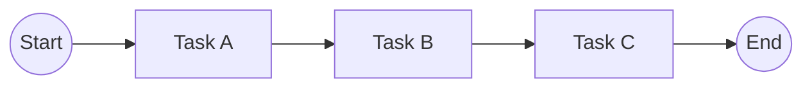
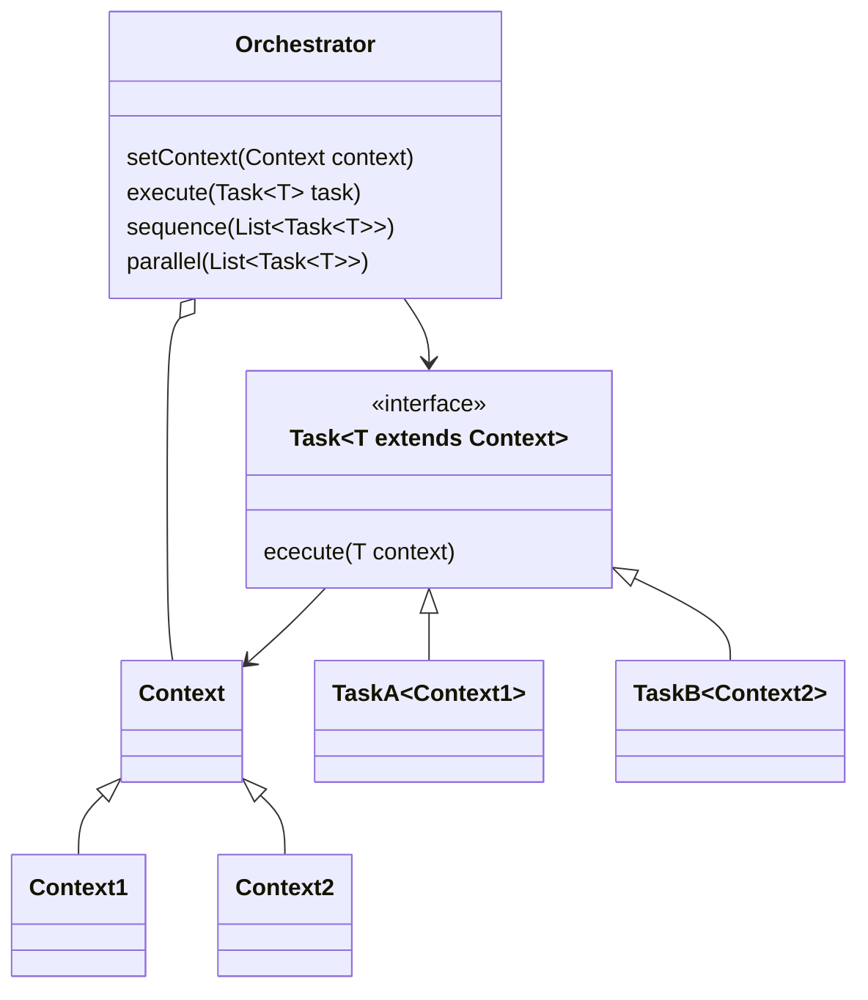

# Simple Orchestrator Pattern
This program implements a simple software design pattern to orchestration complex
processes and workflows. The application is showed in a tiny example.

## Overview
Why this pattern is useful?
- Simplifies implementation due to modularization of individual tasks. 
- Allows you to easily execute tasks sequentially or in parallel.
- Easier understanding of the business logic.
- Faster development

## Definition
In the Orchestration pattern, a single orchestrator manages the execution
of the tasks of a complex process or workflow.

## Usage
Let us assumed that your process or workflow contains the following
steps:


- Create a data class for the context that contains all data that can be used by the tasks (in our example is this the `class MyContext`).
- For each task create a class that implements the interface `Task<MyContext>`.
- In your Main class instantiate the orchestrator object.
- Define the process that is executed by the orchestrator.

```
  Orchestrator orchestrator = new Orchestrator();
  orchestrator
    .setContext(new MyContext())
    .sequence(List.of(new MyTaskA(), new MyTaskB(), new MyTaskC()))
  ;
```

## Structure
UML diagramm



## Example
An example can be found in the package "example" of the code.